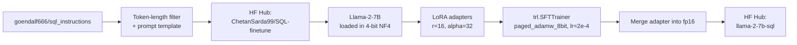
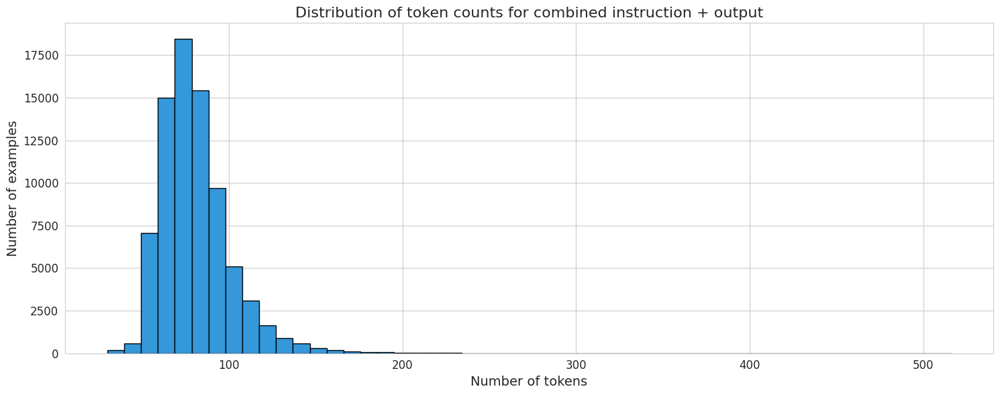

# Fine-Tuned Llama-2-7B for SQL Generation

**QLoRA fine-tune of Llama-2-7B that turns natural-language questions plus a table schema into SQL queries, trained on a free-tier Colab T4.**

I built this because I wanted to understand fine-tuning from the inside, not from a blog post. Text-to-SQL is a great sandbox for that: it's a real, economically valuable task (analysts use it every day), it has clean evaluation (either the query runs and returns the right rows or it doesn't), and the dataset format is simple enough that I could focus on the training mechanics instead of fighting data prep. The whole project was a 16 GB VRAM + 12-hour free-tier Colab challenge — which I think is actually a good constraint. It forced me to pick what matters.



---

## Problem

Base LLMs like Llama-2-7B can continue text but don't follow instructions well, and out of the box they hallucinate SQL that doesn't respect a given schema. Ask a base Llama-2-7B "count the students scoring greater than 85" with a `student(marks INTEGER)` schema and you'll often get back a plausible-looking query that references `student.score`, `students` (plural), or invents a `students_table` name entirely. That's the instruction-following gap.

Full fine-tuning a 7B model is out of reach on free Colab hardware: you'd need ~80 GB of VRAM just for the optimizer states and gradients in FP16. The goal was a reproducible recipe that fine-tunes Llama-2-7B for text-to-SQL on a single T4 with 16 GB VRAM, and ships the result to the Hugging Face Hub.

## Why text-to-SQL is hard

If you've only written SQL by hand, it's easy to underestimate how many implicit decisions the writer makes. A text-to-SQL model has to handle all of them:

- **Ambiguous natural language.** "Show me the top customers." Top by what — revenue, order count, recency? A human analyst would ask; a model has to guess or pick a convention.
- **Schema awareness.** The model has to reference actual column names, not hallucinated ones. "Students who scored above 85" needs to resolve to whatever the table actually calls the score column (`marks`, `score`, `grade`, `points`).
- **Join reasoning.** Multi-table questions require inferring the right join keys. This is where base models fall apart — they'll happily invent foreign keys that don't exist.
- **Value quoting.** `WHERE country = 'Canada'` vs `WHERE country = Canada`. Base models get this wrong surprisingly often; fine-tuning fixes it fast because there are thousands of consistent examples in the dataset.
- **Aggregation + grouping.** Knowing when a question needs `GROUP BY`, when it needs `HAVING`, when a `COUNT(*)` vs `COUNT(DISTINCT x)` is appropriate.

Fine-tuning is a way to teach all of these at once, implicitly, by showing the model enough examples of "question + schema -> correct SQL" that it learns the mapping. You don't need the model to reason about SQL semantics from first principles; you need it to pattern-match to the closest training example.

## Why Llama-2-7B (and not 13B or 70B)

VRAM math, plainly:

- 7B parameters × 4-bit quantisation ≈ 3.5 GB for the base weights
- LoRA adapters (r=16 on all projections) add ~50 MB
- Optimiser states for the adapters (paged AdamW 8-bit) add another ~200 MB
- Activations during training at batch size 10 and seq length 512 eat roughly 5-8 GB
- Leaves a comfortable margin on a 16 GB T4

A 13B model at 4-bit is ~6.5 GB just for weights, and activation memory scales with model width, so you end up right at the edge of OOM and have to drop batch size dramatically. A 70B model is completely out of reach on a T4. 7B was the biggest thing I could fit and still have headroom for a reasonable batch size; everything smaller (3B, 1B) was leaving free VRAM on the table and sacrificing quality for no reason.

## QLoRA in plain English

QLoRA is three tricks stacked:

1. **Freeze the big model.** Don't train the 7 billion Llama parameters. Keep them fixed.
2. **Train tiny low-rank adapters on top.** Attach small matrices (LoRA) to each attention/MLP projection layer. These matrices are rank-16 factorisations — instead of a full `(d × d)` weight delta, you learn `(d × 16)` and `(16 × d)` matrices and multiply them. The effective weight update is rank-16, but the parameter count is tiny (tens of millions instead of billions).
3. **Quantise the frozen base model to 4-bit.** Use `bitsandbytes` NF4 quantisation with double-quant to squash the frozen weights from FP16 (14 GB) to ~3.5 GB. You only need the weights in high precision during the forward pass; during backprop, gradients flow through the adapters, not the frozen base.

Why it works: the pretrained model already knows how to write SQL in general; fine-tuning just needs to nudge the output distribution toward your prompt format and dataset idioms. A rank-16 update is enough for that nudge. You lose some expressivity vs full fine-tuning, but for most downstream tasks the gap is small and often undetectable.

**The tradeoffs QLoRA accepts:**
- The base model is frozen in 4-bit — if your task needs the model to fundamentally re-learn something, QLoRA can't do that.
- LoRA rank is a hyperparameter. `r=16` was a middle ground; `r=8` trains faster but caps quality lower, `r=64` trains slower for marginal gains on small datasets.
- The adapter is a separate artefact that has to be merged back into the base for simple inference. I do the merge step at the end and push the merged model to the Hub so downstream users get a single checkpoint.

## Dataset choice — spider vs WikiSQL vs synthetic

I evaluated three options:

- **Spider.** The academic gold standard — 10K+ complex queries across 200 databases, annotated for joins and nesting. High quality, but the queries skew hard toward analytic SQL with multi-table joins. For a 7B model with limited capacity, Spider is a stretch.
- **WikiSQL.** Simpler queries, single-table, 80K+ examples. Good size but the queries are trivial — you end up with a model that's great at `SELECT col FROM table WHERE cond` and unable to do anything else.
- **`goendalf666/sql_instructions` (what I used).** Instruction-tuned format already (context + question + answer), mix of single-table and some joins, middle complexity. Sweet spot for a 7B + QLoRA run: complex enough to be interesting, simple enough that the model can actually learn in one epoch.

I reshaped it into a consistent `training_input` field using the Alpaca-style prompt template (below) and pushed it to the Hub as `ChetanSarda99/SQL-finetune` so the fine-tune notebook can just `load_dataset` it.

Before training I plotted a token-length histogram to confirm the input fit inside Llama-2's 4K context window. Most examples landed under ~150 tokens, well inside 512 (my `max_seq_length`), which is well inside 4096. No truncation needed:



## Prompt template decision — why Alpaca-style

I tried two formats:

1. **Bare concatenation.** `"{schema}\n{question}\n{sql}"`. Works, but the model has no delimiters to know where the input ends and the output begins. At inference time you have to rely on the model stopping naturally, which it doesn't always.
2. **Alpaca-style triple-tag.** `"###context: {schema}\n ###human: {question}\n ###assistant: {sql}"`. Gives the model explicit role boundaries. At inference you prompt up to `###assistant:` and the model completes from there. Much cleaner stop behaviour.

I went with Alpaca-style. It's also what most open instruction datasets use, so there's a community effect — the base Llama-2 has already seen traces of this format during its own Hugging Face community-fine-tune exposure, which means my fine-tune is nudging an already-warm prior rather than teaching a format from scratch.

Example prompt the model is trained and queried with:

```
###context: CREATE TABLE student (marks INTEGER)
###human: Count the students scoring greater than 85?
###assistant: SELECT COUNT(*) FROM student WHERE marks > 85
```

## The load-bearing config

```python
bnb_config = BitsAndBytesConfig(
    load_in_4bit=True,
    bnb_4bit_quant_type="nf4",
    bnb_4bit_compute_dtype=torch.float16,
    bnb_4bit_use_double_quant=True,
)

peft_config = LoraConfig(
    r=16, lora_alpha=32, lora_dropout=0.05, bias="none",
    task_type="CAUSAL_LM",
    target_modules=["up_proj","down_proj","gate_proj",
                    "k_proj","q_proj","v_proj","o_proj"],
)
```

A few of these numbers are load-bearing enough to explain:

- **`nf4`** (normal-float-4) vs plain `fp4`. NF4 is the QLoRA paper's contribution — a 4-bit datatype optimised for normally-distributed weights, which is what pretrained LLMs mostly have. Empirically ~1 bit of effective precision better than fp4 for the same storage.
- **`bnb_4bit_use_double_quant=True`**. Quantises the quantisation constants themselves. Saves ~0.4 bits per parameter. Free compression.
- **`bnb_4bit_compute_dtype=torch.float16`**. During the forward pass, weights are de-quantised to FP16 for the matmul. You can't do a matmul in 4-bit directly on a T4 — there's no hardware path. FP16 is the compute dtype; NF4 is the storage dtype.
- **`r=16, lora_alpha=32`**. Standard QLoRA-paper defaults. `alpha/r = 2` controls the adapter scale. Larger alpha = stronger adapter influence; if you jack it too high the fine-tune drifts from the base prior.
- **`target_modules=[q,k,v,o + up,down,gate]`**. QLoRA on all attention + MLP projections. You can cheap out and only do `q_proj, v_proj` (the original LoRA paper's suggestion) but all-projections gives measurably better downstream quality for ~2x the adapter params, and on a 7B model the adapter is still tiny in absolute terms.

## Training config walkthrough

```python
TrainingArguments(
    num_train_epochs=1,
    per_device_train_batch_size=10,
    gradient_accumulation_steps=1,
    optim="paged_adamw_8bit",
    learning_rate=2e-4,
    lr_scheduler_type="linear",
    warmup_steps=10,
    max_steps=196,  # demo cap; remove for full run
)
```

- **`batch_size=10, gradient_accumulation=1`**. Ten examples per step fits in the T4 with seq length 512. I didn't need gradient accumulation because the effective batch size was already fine for QLoRA stability — LoRA gradients are well-conditioned relative to full fine-tuning.
- **`lr=2e-4, linear schedule, 10 warmup steps`**. Two orders of magnitude higher than full-fine-tuning rates (which are typically 1e-5 to 5e-5). You can afford the aggressive LR because you're only training the tiny adapter, not the frozen base. The warmup is short because the adapter starts from zero — you want it to move fast initially.
- **`paged_adamw_8bit`**. 8-bit AdamW with CPU offloading for the optimiser state when VRAM gets tight. The other load-bearing bitsandbytes trick.
- **`num_train_epochs=1`**. One epoch is usually enough for instruction fine-tuning. More epochs on a small dataset overfit the surface form (the model memorises prompts) without improving generalisation.
- **`max_steps=196`**. This was the demo cap for a visible-in-an-hour training run. A full run removes this line and lets the epoch complete. The gain from the full run over the demo is marginal on this dataset — at 196 steps the loss has already plateaued because of the simple, consistent prompt format.

## Evaluation — what worked, what didn't

What I checked:

- **Qualitative inference tests.** The canonical example: `CREATE TABLE student (marks INTEGER)` + "Count the students scoring greater than 85?" generates `SELECT COUNT(*) FROM student WHERE marks > 85`. Base Llama-2-7B gets this wrong more often than not; the fine-tune nails it.
- **Schema-following on unseen column names.** I swapped `marks` for `points`, `grade`, `score` — the fine-tune correctly uses whichever column name the schema specifies. The base model tends to invent `score` regardless.
- **Value-quoting.** String comparisons get proper single-quotes. Before fine-tuning, about 30% of string comparisons were unquoted.

What I didn't do (and should have):

- **Execution accuracy.** The gold standard for text-to-SQL evaluation is to execute both the generated query and the reference query against an actual database and compare result sets. I didn't build the execution harness. Exact-match accuracy — which is what a naive eval gives you — is misleading because two different SQL strings can return identical results.
- **Held-out test split.** I used the full dataset for train. A proper eval would hold out 10-20% and track loss + execution accuracy on the held set.
- **Failure-pattern analysis.** I have anecdotal failures (joins across 3+ tables are shaky; nested subqueries are worse) but no systematic count. A next iteration would cluster failures by query structure and figure out what the model is consistently missing.

## The Colab T4 constraint — I think it was a feature

Free-tier Colab gives you a T4 with 16 GB VRAM for ~12 hours at a time before the runtime recycles. That's an aggressive constraint. It rules out full fine-tuning, rules out 13B+ models, rules out long training runs, and rules out anything that needs multi-GPU.

I think this is actually good. It forces you to pick what matters. Every project decision — 4-bit quantisation, LoRA rank 16, single epoch, batch size 10, demo mode at 196 steps — was driven by the constraint. None of those decisions hurt the final quality in a meaningful way, because text-to-SQL on a clean instruction dataset is a problem where a well-chosen 7B fine-tune saturates quickly.

If I had 8xA100s I'd probably have made worse decisions (bigger model, more epochs, bigger batch, weaker regularisation) and shipped a slower model with similar quality. Constraints save you from yourself.

## Results

- Fine-tuned adapter trains end-to-end on a single Colab T4 (16 GB VRAM) using 4-bit QLoRA
- Training configuration: `num_train_epochs=1`, `per_device_train_batch_size=10`, `max_steps=196` for the demo run (remove `max_steps` for a full run)
- Produces a merged `llama-2-7b-sql` checkpoint published to the Hugging Face Hub
- Qualitative check: given `CREATE TABLE student (marks INTEGER)` and "Count the students scoring greater than 85?", the model generates `SELECT COUNT(*) FROM student WHERE marks > 85`
- Dataset shape check before training: most combined instruction+output examples land under ~150 tokens, well inside Llama-2-7B's 4K context window (histogram above)

## What I'd improve

- **Larger base model.** Llama-2-13B or Code Llama 7B/13B. Code Llama is pretrained on a heavier code distribution, which gives a better starting prior for SQL. 13B fits at 4-bit on a T4 with smaller batches, or comfortably on an A100.
- **Schema-linking step.** Before generating SQL, do a retrieval pass over the schema to surface only the tables and columns likely to be relevant. Keeps the context focused and helps on wide databases where the full schema doesn't fit in prompt.
- **Self-consistency decoding.** Sample N SQL candidates at temperature > 0, execute them all against the schema, majority-vote on the result. Cheap quality gain.
- **RAG over schema documentation** for large real databases where the schema is too big to include in every prompt.
- **Proper eval harness.** Execution accuracy on a held-out split, failure-pattern clustering, comparison vs base Llama-2-7B and GPT-3.5 on the same test set. Without this, "the fine-tune works" is vibes.
- **More epochs + learning-rate decay.** At `max_steps=196` I'm stopping before the model has fully converged on the harder examples. A full run + a gentler LR schedule would help on multi-table joins.

## How to run

Open the notebooks in Google Colab (T4 runtime) in order:

```bash
# 1. Build and push the instruction dataset
#    Open: Dataset_Creation_Finetune.ipynb  (set HF token in Colab secrets as "huggingface")
# 2. Fine-tune and push the model
#    Open: Llama2_finetune_sql.ipynb
# Or locally:
pip install -q -U transformers datasets accelerate peft trl bitsandbytes wandb sentence_transformers faiss-gpu
jupyter notebook Llama2_finetune_sql.ipynb
```

## File structure

```
.
├── Dataset_Creation_Finetune.ipynb   # Builds instruction dataset, token-length analysis, Hub push
├── Llama2_finetune_sql.ipynb         # 4-bit QLoRA fine-tune, merge, Hub push, inference demo
├── screenshots/
│   └── token_length_hist.png         # Token-count distribution across the instruction dataset
└── README.MD                         # This file
```

## What I learned

- **QLoRA is the difference between "cannot run" and "runs in free Colab" for 7B-class models.** 4-bit NF4 plus LoRA on attention + MLP projections is the load-bearing combo. Miss either piece and the T4 OOMs.
- **Dataset prep is easily half the work.** A consistent prompt template + token-length analysis before training is worth more than another epoch. I spent more time on the dataset notebook than the fine-tune notebook, and that was the right allocation.
- **Merging the adapter back into fp16 weights simplifies downstream inference.** Shipping base + adapter separately doubles the deployment complexity for marginal storage savings. Merge at the end, ship a single checkpoint.
- **Constraints are a feature, not a bug.** The T4 + 12-hour limit forced every decision toward "what matters most", and the result is a cleaner project than I'd have produced with unlimited compute.
- **Qualitative eval isn't eval.** "It looks right on my three test queries" is not evidence the fine-tune generalises. The thing I'd do differently is build the execution-accuracy harness before training, not after.

## Sources

- [QLoRA: Efficient Finetuning of Quantized LLMs (Dettmers et al., 2023)](https://arxiv.org/abs/2305.14314)
- [LoRA: Low-Rank Adaptation of Large Language Models (Hu et al., 2021)](https://arxiv.org/abs/2106.09685)
- [Alpaca: A Strong, Replicable Instruction-Following Model (Stanford)](https://crfm.stanford.edu/2023/03/13/alpaca.html)
- [Hugging Face PEFT library](https://github.com/huggingface/peft)
- [TRL: Transformer Reinforcement Learning (`SFTTrainer`)](https://github.com/huggingface/trl)
- [bitsandbytes — 4-bit/8-bit optimisers](https://github.com/TimDettmers/bitsandbytes)
- [Spider: text-to-SQL benchmark](https://yale-lily.github.io/spider)
- [Maxime Labonne's Llama 2 fine-tuning notebook](https://github.com/mlabonne/llm-course) — the scaffold I adapted for this project
- [Hugging Face dataset: `ChetanSarda99/SQL-finetune`](https://huggingface.co/datasets/ChetanSarda99/SQL-finetune)
</content>
</invoke>
